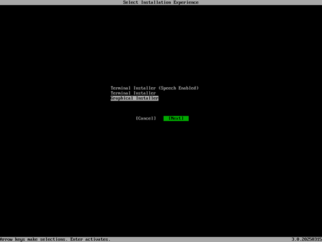
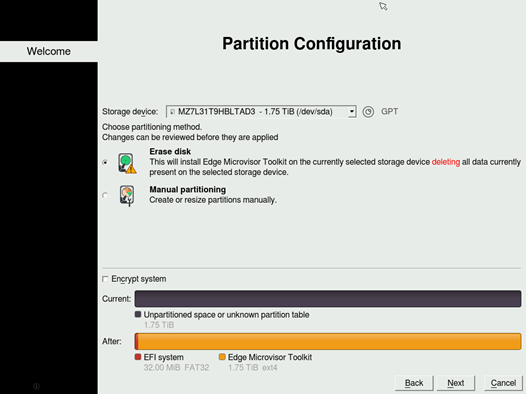
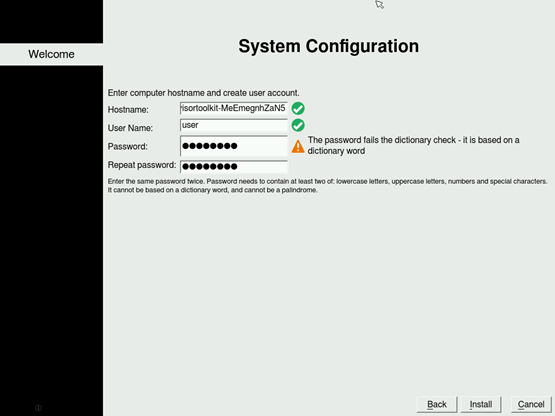
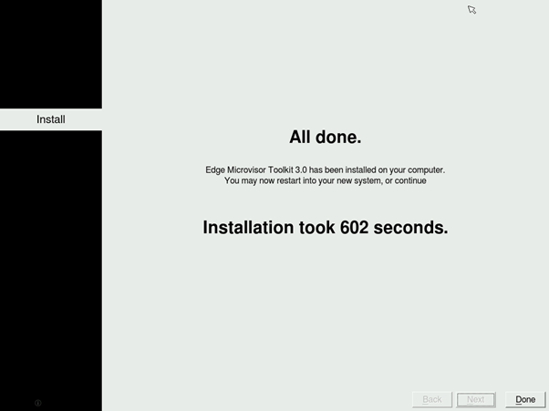

# Install Edge Microvisor Toolkit

Edge Microvisor Toolkit can be installed on bare metal, or as a virtual machine. This section
describes in detail how to quickly install and try out Edge Microvisor Toolkit on your system.

## Virtual Machine with Hyper-V

When using Hyper-V you can install the ISO to a virtual hard drive that you create, or
you can attach an existing VHD artifact produced by the build pipeline. See the steps below:

1. From Hyper-V select *Action-> New-> Virtual Machine*.
2. Provide a name for your VM and press *Next*.
3. Select *Generation 1 (VHD)* or *Generation 2 (VHDX)*, then press *Next*.
4. Set the desired amount of memory to allocate, then press *Next*.
5. Select a virtual network switch, then press *Next*.
6. Select *Create a virtual hard disk* and one of two options:
   - either:
     1. Select a location for your VHD(X) and set your desired disk size, then press *Next*.
     2. Select *Install an operating system from a bootable image file* and browse to your
      microvisor ISO.
     3. Press *Finish*.
   - or:
     1. Select *Use existing VHD* to proceed with the VHD(X) produced by the build infrastructure.
     2. This option does not need the ISO, just press *Next* and *Finish*.

[Gen2/VHDX Only] Fix Boot Options

1. Right click your virtual machine from Hyper-V Manager. Select *Settings...*
2. Select *Security* and disable *Secure Boot*.
3. Select *Firmware* and adjust the boot order so DVD is the first and Hard Drive is second.
4. Select *Apply* to apply all changes.
5. Right click your VM and select *Connect...*. Select *Start*.
6. Follow the Installer prompts to install your image.
7. When installation completes, select *Restart* to reboot the machine. The installation ISO
   will be automatically ejected.
8. When prompted, sign in to your Edge Microvisor Toolkit using the username and password
   provisioned through the Installer.

> **Note:**
  When using an existing VHD, the default username/password is root/root.

## Virtual Machine with Oracle Virtual Box

1. Start Oracle VM VirtualBox Manager.
2. Create a new VM and chose a name for the virtual machine.
3. Select the ISO image of Edge Microvisor Toolkit.
4. Under *Operating System*, select *Linux*, sub-type *Fedora (64-bit)*.
5. Configure the number of CPUs and the amount of memory to allocate to the virtual machine.
6. Enable EFI.
7. Create the virtual disk image. If you use a pre-existing disk image (VHD or RAW), convert
  it to VDI first.

### Converting Image File to VDI

You can convert a VHD or RAW image to the VDI format, which is natively supported by
VirtualBox. Simply, navigate to the installation folder of VirtualBox, e.g.
`C:\Program Files\Oracle\VirtualBox` and run the commands below in a terminal to convert:

a VHD disk image:

```bash
VBoxManage clonehd --format VDI <input-vhd-image.vhd> <output-vdi-image.vdi>
```

a RAW disk image:

```bash
VBoxManage convertfromraw <input-vhd-image.img> <output-vdi-image.vdi> --format VDI
```

## Virtual Machine with KVM

On Linux you can install and use Edge Microvisor Toolkit directly with KVM using the
graphical `virt-manager` and `virsh`. You can install the OS using the ISO image, or the
image file. On KVM it is preferred to use a RAW image, although it does support multiple
image formats.

On Ubuntu, install `virt-manager` or `virsh`:

```bash
sudo apt update
sudo apt install virt-manager
sudo apt install libvirt-clients
sudo apt install libvirt-daemon-system
sudo usermod -a -G libvirt $(whoami)
```

1. Start `virt-manager`.
2. Create a *New Virtual Machine*.
3. Select *Local installation media* (ISO image) or alternatively *Import existing disk
   image* and select the RAW disk image.
4. Deselect *Automatically detect from the installation /source* and choose the *Fedora* OS
   type manually.
5. Configure the number of CPUs and the amount of memory to allocate to the virtual machine.
6. Create the virtual disk image.
7. Create a name for the virtual machine and configure network as desired.

| Image              | Support                                                              |
| ------------------ | -------------------------------------------------------------------- |
| RAW (.img, .raw)   | ✅ Best performance, directly supported                              |
| QCOW2 (.qcow2)     | ✅ KVM's native format, supports snapshots and compression           |
| VHD (.vhd, .vpc)   | ⚠️ Limited. Direct use is unreliable, conversion is recommended.     |
| VDI (.vdi)         | ❌ No                                                                |

## Bare metal with ISO

### Requirements

You will need:

- [EMT-D 3.0](https://files-rs.edgeorchestration.intel.com/files-edge-orch/microvisor/iso/EdgeMicrovisorToolkit-3.0.iso) latest release
- USB flash drive (min. 8GB)
- Access to the target machine
- Optional: Monitor and keyboard, or BMC/iDRAC/iKVM access

### Create Bootable USB (Linux)

Follow the steps below to create a bootable USB device to install Edge Microvisor Toolkit
on your bare metal system.

Ensure you have the microvisor ISO file you want to flash saved on your system. Insert the
USB drive and identify it.

```bash
lsblk
```

Compare the output before and after inserting your USB to identify its device name
(e.g., /dev/sdb). Flash the ISO Image. Use the `dd` command to write the ISO image.
Replace `/path/to/your.iso` with the ISO’s location and `/dev/sdb` with your USB device.

```bash
sudo dd if=/path/to/your.iso of=/dev/sdb bs=4M status=progress oflag=sync
# Warning: Double-check the device name. Using a wrong device can overwrite data.
```

Sync and Eject: Once `dd` has finished, run:

```bash
sudo sync
```

Then, safely remove the USB drive.

### Create Bootable USB (Windows)

On Windows, download and install an ISO writer software such as [Rufus](https://rufus.ie/en).

1. Insert the USB device (8GB or more)
1. Launch Rufus
1. Select the USB drive from the dropdown list
1. Boot selection: Select your EMT 3.0 iso file
1. Image option: Leave default or choose 'Standard Installation'
1. Partition scheme: MBR (for legacy BIOS) or GPT (for UEFI)
1. File system: FAT32 (recommended)
1. Click Start
1. Confirm warnings about data being erased
1. Wait for completion and safely eject the USB

### Boot and Install Edge Microvisor Toolkit

**Boot from USB**
1. Insert the USB into the target machine
1. Enter BIOS/Boot menu
1. Choose USB drive as the boot device

**Select Installer**
1. Choose 'Terminal Installer' or 'Graphical Installer' when prompted 

**Follow Installation Prompts**
1. Accept license
1. Select target disc to install EMT on
   
1. Skip disc encryption (optional)
1. Host name - keep as default
   
1. Create username and password
1. Confirm and begin installation

**Restart the System**
1. After completion, click Restart
   
1. EMT image will boot from the installed disc

### Post Installation Check

After reboot, login and check the EMT OS version. Run the following command

```bash
cat /etc/os-release
```

You should see EMT image version. **Installation Complete**. You are
now ready to use the EMT 3.0 image!

## Next

- Learn how to [Enable Secure Boot for Edge Microvisor Toolkit](sb-howto.md).
- Learn how to customize and manually [build microvisor images](building-howto.md).
